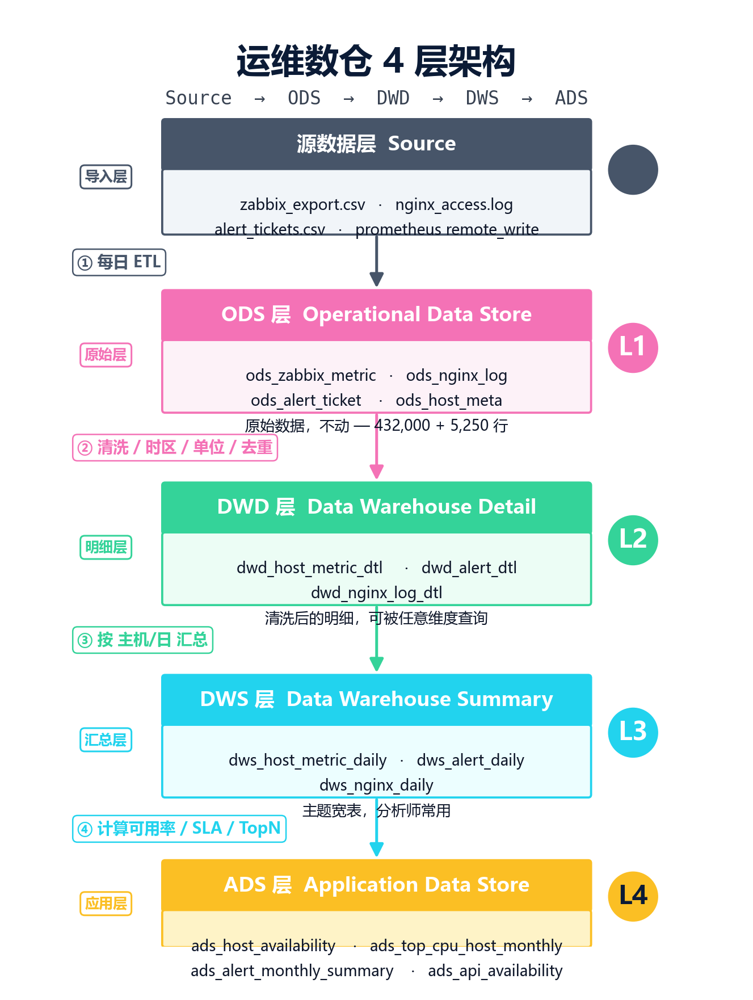

# DuckDB 运维数仓实战 (Operational Data Warehouse with DuckDB)

> 零 Hadoop、零集群，**半小时**搭起一套可用的运维数仓。
> 配套公众号文章：《运维数据分析· DuckDB 数据仓库实战》

[](https://duckdb.org)
[](https://www.python.org)
[](LICENSE)
[](https://github.com)

---

## 这是什么？

一个**完整可运行**的运维数据仓库 Demo，使用 **DuckDB 单文件**实现经典的 ODS → DWD → DWS → ADS 四层架构。

| 指标 | 数值 |
| --- | --- |
| 模拟数据规模 | 432,000 条 Zabbix 监控 + 5,000 条 Nginx 日志 + 200 条告警工单 |
| 数据时间跨度 | 90 天 |
| 主机数 | 50 台 |
| 表数量 | 11 张（4 层 × 3 业务） |
| 数据库文件大小 | ~7 MB |
| 安装耗时 | < 30 秒 |
| 查询响应 | 秒级（432k 行聚合） |

## 4 层架构



每一层的职责：

| 层级 | 名称 | 作用 | 业务示例 |
| --- | --- | --- | --- |
| **ODS** | Operational Data Store | 原始落盘，不动数据 | `ods_zabbix_metric`、`ods_nginx_log` |
| **DWD** | Data Warehouse Detail | 清洗 / 时区 / 单位 / 去重 | `dwd_host_metric_dtl`、`dwd_alert_dtl` |
| **DWS** | Data Warehouse Summary | 按维度轻度聚合 | `dws_host_metric_daily`、`dws_alert_daily` |
| **ADS** | Application Data Store | 报表即用，喂给周报 | `ads_host_availability`、`ads_top_cpu_host_monthly` |

---

## 一键运行

```bash
# 1. 准备
pip install duckdb pandas

# 2. 启动（30 秒搭完整数仓）
python build_warehouse.py

# 3. 看报表
python report_demo.py
```

跑完全部 6 步，会得到一个 `operational_warehouse.duckdb` 文件（约 7 MB），里面包含 **4 层架构 + 11 张表 + 4 张现成报表**。

---

## 手动分步（生产调试推荐）

```bash
python gen_warehouse_data.py     # 1. 生成 432,000 条模拟数据
python ods_layer.py              # 2. 建 ODS 层（原始落盘）
python dwd_layer.py              # 3. 建 DWD 层（清洗）
python dws_layer.py              # 4. 建 DWS 层（汇总）
python ads_layer.py              # 5. 建 ADS 层（应用）
python report_demo.py            # 6. 出 ADS 报表
```

每一步独立可重跑：DWD 错就重跑 DWD，DWS 错就重跑 DWS。

---

## 报表输出示例

```
============================================================
【月度告警总览】每个机房每月告警量、P0/P1 严重告警数、平均恢复时长
============================================================
stat_month  datacenter  total_alerts  p0_alerts  p1_alerts  avg_recovery_min
2026-01-01        机房A           80        18        23           119.1
2026-01-01        机房B           63        14        10           100.4
2026-01-01        机房C           57        15        13           116.2

============================================================
【1 月 Top10 高 CPU 主机】月度 CPU 占用最高 10 台机器
============================================================
host_id  avg_cpu_pct  peak_cpu_pct
H00027        31.50       100.0
H00036        31.21       100.0
H00002        31.17       100.0
...

============================================================
【接口可用率】按 URL 维度统计 5xx 错误占比
============================================================
url         req_cnt  err5xx_cnt  availability_pct
/api/login      61         21           65.57
/api/order      60         20           66.67
/api/pay        60         14           76.67
```

---

## 目录结构

```
ops-warehouse/
├── README.md                      ← 你正在读
├── build_warehouse.py             ← 一键搭建入口
├── gen_warehouse_data.py          ← 生成模拟数据
├── ods_layer.py                   ← ODS 层
├── dwd_layer.py                   ← DWD 层（清洗）
├── dws_layer.py                   ← DWS 层（汇总）
├── ads_layer.py                   ← ADS 层（应用）
├── report_demo.py                 ← 报表输出
├── operational_warehouse.duckdb     ← 跑完后生成的数仓文件
├── imgs/
│   ├── warehouse_4layer.png       ← 4 层架构图
└── data/
    ├── host_meta.csv              ← 50 台主机元数据
    ├── zabbix_export.csv          ← 432,000 条监控明细
    ├── nginx_access.csv           ← 5,000 条访问日志
    └── alert_tickets.csv          ← 200 条告警工单
```

---

## 4 层核心 SQL 模板

### ODS → DWD（清洗）

```sql
-- UTC → 北京时间
CREATE OR REPLACE TABLE dwd_host_metric_dtl AS
SELECT
    hostid                          AS host_id,
    itemid                          AS metric_name,
    CAST(clock_utc AS TIMESTAMP) + INTERVAL 8 HOUR  AS ts_beijing,
    CAST(value AS DECIMAL(6, 2))    AS metric_value
FROM ods_zabbix_metric;
```

### DWD → DWS（汇总）

```sql
-- 主机 × 日 × 指标（含 p95 分位）
CREATE OR REPLACE TABLE dws_host_metric_daily AS
SELECT
    ts_hour::DATE                              AS stat_date,
    host_id,
    metric_name,
    AVG(metric_value)                          AS avg_value,
    MAX(metric_value)                          AS max_value,
    PERCENTILE_CONT(0.95) WITHIN GROUP (ORDER BY metric_value) AS p95_value,
    COUNT(*)                                   AS sample_cnt
FROM dwd_host_metric_dtl
GROUP BY ts_hour::DATE, host_id, metric_name;
```

### DWS → ADS（应用：TopN）

```sql
-- 月度 Top10 高 CPU 主机（DuckDB 特色 QUALIFY 语法）
CREATE OR REPLACE TABLE ads_top_cpu_host_monthly AS
SELECT
    DATE_TRUNC('month', stat_date) AS stat_month,
    host_id,
    ROUND(AVG(avg_value), 2)       AS avg_cpu_pct,
    ROUND(MAX(max_value), 2)       AS peak_cpu_pct
FROM dws_host_metric_daily
WHERE metric_name = 'cpu_pct'
GROUP BY DATE_TRUNC('month', stat_date), host_id
QUALIFY ROW_NUMBER() OVER (
    PARTITION BY DATE_TRUNC('month', stat_date)
    ORDER BY AVG(avg_value) DESC
) <= 10;
```

---

## 为什么选 DuckDB？

| 维度 | Hive/Spark | DuckDB |
| --- | --- | --- |
| 部署成本 | 高（Hadoop/YARN/Hive） | `pip install duckdb` |
| 单机性能 | 一般 | 1 亿行聚合秒级 |
| 运维成本 | 需要专门团队 | 零运维 |
| 学习曲线 | 陡 | 标准 SQL |
| 文件大小 | TB 级 | MB 级（足够中型团队） |

**适合人群**：

- 🏢 中小型公司的运维 / 数据团队
- 🎓 数据分析入门学习
- 🧪 快速搭建 PoC 验证业务想法
- 💼 想从 Excel 透视表升级到 SQL 数仓的个人

---

## 进阶：从模拟到生产

`gen_warehouse_data.py` 只生成模拟数据。**真实生产环境**一般会用这些工具替代：

| 数据源类别 | 工具 | 接入方式 |
| --- | --- | --- |
| **日志** | ELK (Filebeat + Logstash + ES) | Filebeat 收集 → Logstash 过滤 → ES 落地 |
| **监控** | Zabbix MySQL | 直连 Zabbix 数据库，读 `history` 表 |
| **时序** | Prometheus | `remote_write` → 对象存储 → DuckDB 导入 |
| **业务库** | chat2db CLI | 直连 MySQL/Postgres，`COPY` 到本地 |
| **数据治理** | 自建 `etl_clean.py` | 脱敏 / 过滤 / 异常剔除 / 单位统一 |

接入方法都是「先落到 ODS，再走相同的 DWD/DWS/ADS 链路」——架构不变，只换数据源。

---

## 常见坑

| 现象 | 原因 | 解决 |
| --- | --- | --- |
| ODS 太大导致 DWD 跑得慢 | 没有分区 | DWD 加 `PARTITION BY`（按日期） |
| DWS 聚合耗时太久 | 维度太多 | 只聚合"经常查询的维度"，其他走 DWD |
| ADS 表数爆炸 | 一张表一个指标 | 一个业务域一张表，比如 `ads_availability` 覆盖所有可用率查询 |
| DuckDB 文件太大 | 频繁删除/更新 | 跑 `VACUUM` 或导出 Parquet 分文件 |
| 时区混乱 | ODS 存了多种时区 | ODS 一律存 UTC，DWD 统一转北京时间 |
| ATTACH SQLite 写冲突 | 两个进程同时打开 | 写只用一个进程，DuckDB ATTACH 时设 `READ_ONLY` |

---

## 数据治理进阶模板（可选）

如果你想给 ODS 加一层数据治理（脱敏 / 过滤 / 单位统一），可以这样扩展：

```python
"""etl_clean.py — 数据治理：ODS → CLEAN_ODS"""
import duckdb

con = duckdb.connect("operational_warehouse.duckdb")

con.execute("""
CREATE OR REPLACE TABLE clean_ods_zabbix_metric AS
SELECT
    hostid,
    itemid,
    clock_utc,
    -- 1. 异常值过滤：< 0 或 > 100 的丢弃
    CASE WHEN value < 0 OR value > 100 THEN NULL
         ELSE value END                          AS value_cleaned,
    -- 2. 脱敏：host_id 末 3 位替换为 *
    host_id                                       AS host_id_raw,
    'H' || SUBSTR(host_id, 2, 2) || '***'        AS host_id_masked
FROM ods_zabbix_metric
WHERE value IS NOT NULL;
""")
```

把这个 `clean_ods_*` 当成新的"上游"，DWD 改成从 `clean_ods_*` 读即可。**架构不动，只换数据源**。

---

## 配套文章

- 📖 公众号：《运维思维链》
- 📖 系列：《运维数据分析》

---

## 参考资料

- [DuckDB 官方文档](https://duckdb.org/docs/)
- [DuckDB 中文教程](https://duckdb.org/docs/api/python.html)
- [PERCENTILE_CONT 用法](https://duckdb.org/docs/sql/aggregates)
- [QUALIFY 子句](https://duckdb.org/docs/sql/query_syntax/qualify)
- [ATTACH SQLite](https://duckdb.org/docs/sql/attach.html)

---

## License

MIT © tomson5566

---

## 致谢

如果你用这套仓库搭起了生产数仓，欢迎提 PR 或 Issue 分享你的实践！

_Tags: `DuckDB` · `数据仓库` · `运维` · `数仓分层` · `ODS` · `DWD` · `DWS` · `ADS` · `SQL` · `Python`_